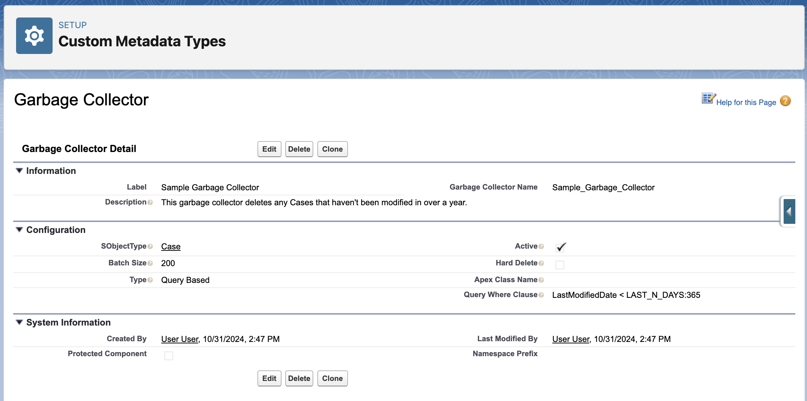

# apex-garbage-collector

Data clutter is a common challenge in Salesforce orgs. apex-garbage-collector is a lightweight solution designed to automate the cleanup of stale data, helping you maintain an organized and efficient environment. With configurable, flexible rules, this tool is straightforward to set up and adaptable to various data deletion needs. Administrators can leverage its ease of configuration, while developers benefit from options for custom query logic when needed.

## Installation

`apex-garbage-collector` is available as an unlocked package. To install, run the following command, replacing `<<package_version_id>>` with the latest version's package ID (which begins with `04t`):

```sh
sf package install -p <<package_version_id>>
```

## Usage
Using `apex-garbage-collector` is easy. In most cases, administrators can use the package without the need for any custom code. However, the package does provide a mechanism for developers to write custom query logic if required.

### Configure Garbage Collector Jobs with `GarbageCollector__mdt`
Use the `GarbageCollector__mdt` custom metadata type to define which records can be deleted by the Garbage Collector. This object contains a number of configuration options.



Generally speaking, there are two types of Garbage Collectors:
- **Query Based**: (Most Common) Uses the record's `SObjectType` and `Query Where Clause` fields to create a SOQL query that will find and delete matching records. This approach does not require any additional code. For an example, see above.
- **Apex Based**: Delegates the responsibility of querying records to be deleted to a custom apex class, stored in the `Apex Class Name` field. Use this option when simple query logic does not capture your use case.

### Run the `GarbageCollector` Job
Once you've defined criteria for deleting records with `GarbageCollector__mdt`, running the logic is easy. You run the job on a one-off basis via this anonymous apex:

```java
Id jobId = new GarbageCollector()?.launch();
System.debug(jobId);
```

When the job runs, it creates a batch job for each `GarbageCollector__mdt` record. 

### Schedule Recurring Runs w/`GarbageCollectorSchedulable`
You can schedule future runs of your Garbage Collector using the `GarbageCollectorSchedulable` class. You can do so in the [Setup UI](https://help.salesforce.com/s/articleView?id=platform.code_schedule_batch_apex.htm&type=5), or by running some anonymous apex like the one below:
```java
String jobName = GarbageCollectorSchedulable.class.getName();
System.Schedulable job = new GarbageCollectorSchedulable();
String nightlyAtMidnight = '0 0 0 * * ?';
Id jobId = System.schedule(jobName, nightlyAtMidnight, job);
System.debug('Scheduled! ' + jobId);
```

### Optional Plugins
Use the `GarbageCollectorSetting__c` Custom Settings object to define application-level settings and plugins. Currently, this object contains just one field, but it may be expanded in future versions.

#### Logging
By default, the application will post internal logs to standard Salesforce debug logs. If desired, you can write an Apex adapter which will cause these internal logs to be published via the logging application of your choice.

To get started, first create an Apex class that fulfills these requirements:
1. Implement the `GarbageCollectorLogs.Adapter` interface. 
    - This interface has just one method: `
2. Ensure your class has a publicly accessible, 0-argument constructor

Here's a sample adapter that hooks into the [`apex-logger`](https://github.com/jasonsiders/apex-logger) framework:
```java
public class SampleAdapter implements GarbageCollectorLogs.Adapter {
    private Logger logger = new Logger();

    public void log(System.LoggingLevel level, Object message) {
        this.logger?.log(level, message);
    }

    public void save() {
        this.logger?.publish();
    }
}
```

Once defined, list the fully qualified API name of your class, including namespace (if any) in the `Log Adapter` field:
